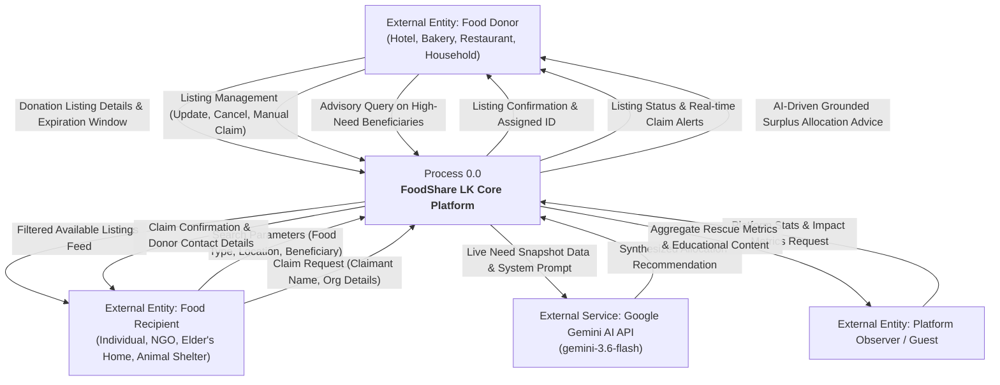
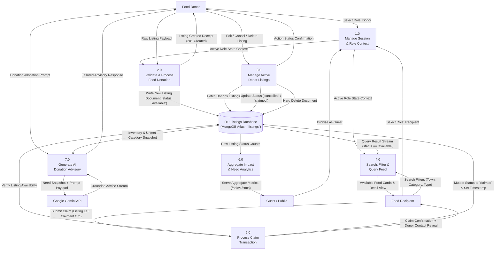
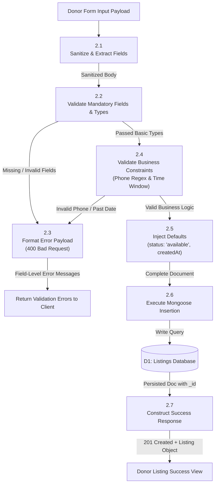
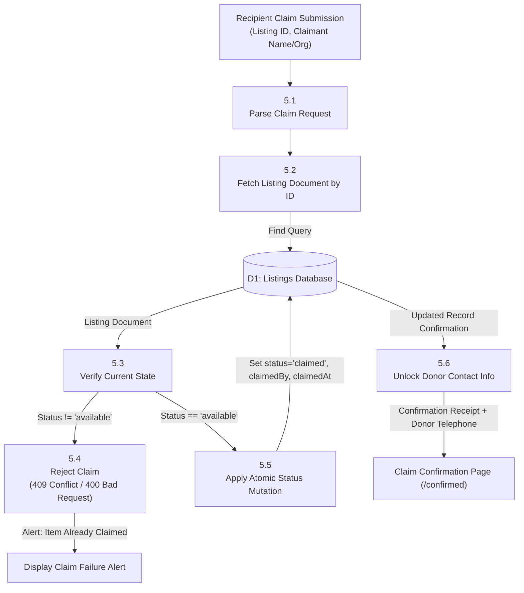
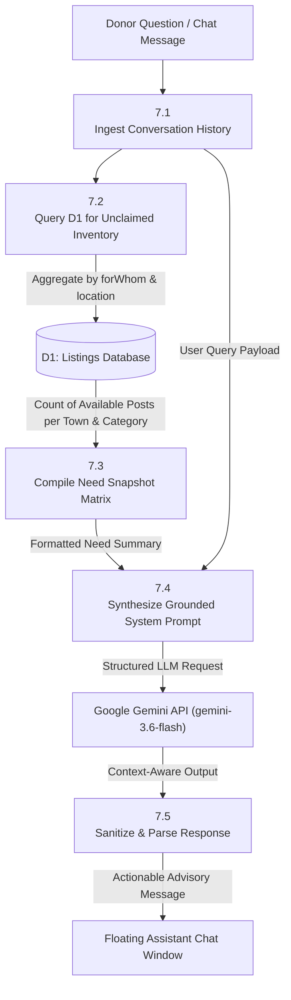
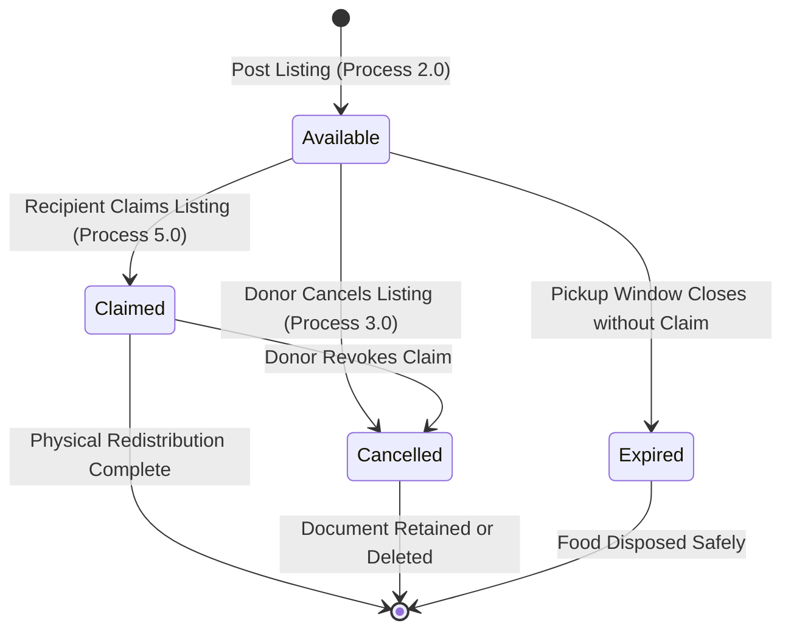

# Data Flow Diagrams (DFD) — FoodShare LK
### Surplus Food Donation & Redistribution Platform for Sri Lanka
**Document Version:** 1.0 · **Date:** 4 September 2026 · **Standard:** Structured Analysis (Yourdon / DeMarco & Gane-Sarson Notations)

---

## 1. Introduction & Notation Overview

This document specifies the logical and physical data flows within the **FoodShare LK** platform. The system facilitates rapid, end-of-day food donation matching across commercial donors (hotels, bakeries, restaurants, households) and beneficiaries (NGOs, soup kitchens, eldercare homes, animal welfare groups).

### DFD Notation Conventions

| Element Type | Symbol / Representation | Description |
|---|---|---|
| **External Entity** | Rectangle `[Name]` | Boundary sources or sinks of data outside direct system control (e.g. Donor, Recipient, Gemini API). |
| **Process** | Rounded Rectangle `(Process Name)` | Transformations or operational procedures applied to data flows. |
| **Data Store** | Double Line / Open Rectangle `[(Data Store Name)]` | Persistent repository of state (e.g. MongoDB Atlas collections). |
| **Data Flow** | Arrow `-->|Label|` | Directed pipeline representing movement of typed information packets. |

---

## 2. DFD Level 0: Context Diagram

The Context Diagram defines the external boundaries, user actors, external cognitive services, and primary informational transactions interacting with the FoodShare LK core system.

---

## 3. DFD Level 1: System Decomposition

The Level 1 diagram decomposes Process 0.0 into seven core discrete processing modules, detailing interactions with the persistent `D1: Listings Store` (MongoDB Atlas) and runtime context.

---

## 4. DFD Level 2: Sub-Process Decompositions

### 4.1 Sub-Process 2.0: Process Food Donation Submission

Decomposes the donation registration and validation pipeline to ensure high data integrity, strict phone format adherence, and proper date ranges before persistence.

---

### 4.2 Sub-Process 5.0: Process Food Claim Transaction

Decomposes the atomic claiming process to prevent race conditions and ensure that already-claimed or expired food cannot be claimed more than once.

---

### 4.3 Sub-Process 7.0: Grounded AI Advisory Pipeline

Decomposes the integration with the Google Gemini AI service, illustrating how live database aggregations eliminate AI hallucination and ground suggestions in actual real-time surplus need.

---

## 5. Data Dictionary

### 5.1 Data Store Specifications

#### D1: `listings` Collection (MongoDB Atlas)
Stores all surplus food postings across their operational lifecycle.

| Field Name | Type | Key / Constraint | Description | Example |
|---|---|---|---|---|
| `_id` | ObjectId | Primary Key | MongoDB Unique Identifier | `66f81a29c1b...` |
| `donorName` | String | Required, Trim | Registered name of donor or business | `"Perera Bakery"` |
| `donorType` | String | Required, Enum | Entity classification: `hotel`, `bakery`, `restaurant`, `household`, `other` | `"bakery"` |
| `foodItem` | String | Required, Trim, Text Index | Description of surplus food available | `"Fresh Bread Loaves"` |
| `quantity` | Number | Required, Min: 1 | Numeric quantity offered | `20` |
| `quantityUnit` | String | Required, Enum | Standard measurement unit: `kg`, `packets`, `plates`, `loaves`, `items` | `"loaves"` |
| `forWhom` | String | Required, Enum, Index | Beneficiary target: `people`, `animals`, `both` | `"both"` |
| `location` | String | Required, Trim, Text Index | Town, suburb, or neighborhood | `"Ratnapura Town"` |
| `pickupWindowStart` | Date | Required | Earliest acceptable pickup timestamp | `"2026-09-04T18:00:00Z"` |
| `pickupWindowEnd` | Date | Required | Deadline pickup timestamp (must be > Start) | `"2026-09-04T21:00:00Z"` |
| `contactNumber` | String | Required, Regex Match | Sri Lankan phone format: `/^(?:\+94\|0)[0-9]{9}$/` | `"0771234567"` |
| `notes` | String | Optional, Trim | Extra handling/dietary notes | `"Warmly packed in cartons"` |
| `status` | String | Required, Enum, Default: `available` | State machine: `available`, `claimed`, `expired`, `cancelled` | `"available"` |
| `claimedBy` | String | Optional, Trim | Name / Organization of claiming party | `"Robin Hood Army SL"` |
| `claimedAt` | Date | Optional | Timestamp when claim transaction settled | `"2026-09-04T19:30:00Z"` |
| `createdAt` | Date | Auto Timestamp | Document generation timestamp | `"2026-09-04T17:00:00Z"` |
| `updatedAt` | Date | Auto Timestamp | Document mutation timestamp | `"2026-09-04T19:30:00Z"` |

---

### 5.2 Data Flow Specifications

| Data Flow Identifier | Source | Destination | Data Structure / Composition |
|---|---|---|---|
| `Donation_Listing_Request` | Food Donor | Process 2.0 | `donorName` + `donorType` + `foodItem` + `quantity` + `quantityUnit` + `forWhom` + `location` + `pickupWindowStart` + `pickupWindowEnd` + `contactNumber` + `[notes]` |
| `Validation_Error_Response` | Process 2.0 | Food Donor | `{ success: false, errors: [ { field: string, message: string } ] }` |
| `Listing_Persistence_Doc` | Process 2.0 | D1: Listings Store | Complete listing entity with `status: 'available'` |
| `Search_Query_Parameters` | Food Recipient | Process 4.0 | `?foodType=string & location=string & forWhom=enum & status=enum` |
| `Listings_Feed_Stream` | D1: Listings Store | Process 4.0 | Array of `Listing` objects sorted by `createdAt: -1` |
| `Claim_Execution_Request` | Food Recipient | Process 5.0 | `listingId: ObjectId` + `claimedBy: string` |
| `Claim_Receipt_Payload` | Process 5.0 | Food Recipient | `{ success: true, data: Listing }` revealing `contactNumber` and pickup instructions |
| `Need_Snapshot_Summary` | D1: Listings Store | Process 7.0 | Total unclaimed listings, breakdown by `forWhom`, top locations with surplus |
| `AI_Grounded_Prompt` | Process 7.0 | Google Gemini API | System instructions + Need Snapshot Summary + User Query History |
| `Aggregate_Stats_Payload` | Process 6.0 | Guest / Public | `{ success: true, stats: { totalListings, availableListings, claimedListings } }` |

---

## 6. Process State Transition Diagram

The lifecycle of each donation entry follows this deterministic finite state machine:

